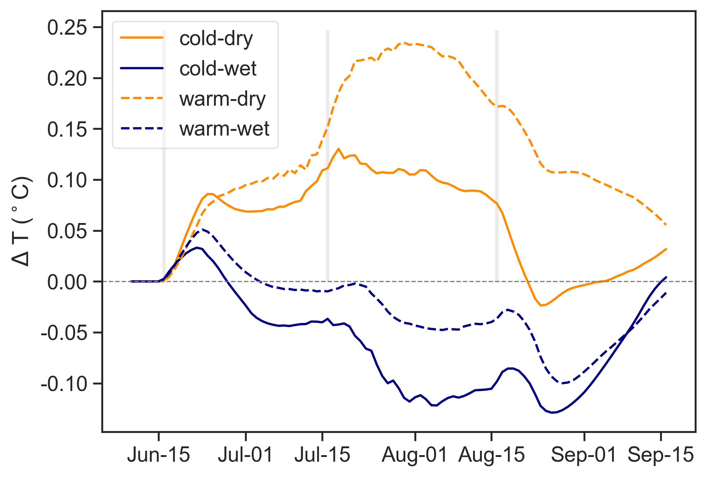

## We revised the codes to make them working well. 

1. to use ATS in docker,  may only for debug ... because it is really slow when writing files to local ... 

		docker run -it --name WoC --volume=$PWD:/home:delegated --workdir=/home -p 3212:8888 --restart=no --runtime=runc -t -d wk1984/ats120_2023
		
1. reproduced figures ... Note that, those figures we produced are slightly different from Hamm et al. (2023) Nature Communications, because (1) we run spinup only for 20 years, and (2) we change "dessicated zone thickness [m]" in simulation xml files from 0.05 to 0.10, consistent with the spinup processes.

## Original notes ...

Warming or cooling? The impact of heavy summer rainfall on permafrost environments

Instructions on how to reproduce model results

This repository (in therory) provides all the data and scripts needed to reproduce the main model results and figures in the main text of the publication. The setups for sensitivity analysis are not included.

Structure:
[] 0peat_freezeup: first initialization step to freeze column with water table at target depth for the column model with no organic layer
[] 02peat_freezeup: first initialization step to freeze column with water table at target depth for the column model with a 20cm thick organic layer
[] 05peat_freezeup: first initialization step to freeze column with water table at target depth for the column model with a 50cm thick organic layer
[] data: mesh files and forcing datasets for the model runs
[] plots: directory for plots produced by the plotting scripts
[] regions: The structure is the same for all climate cases. Saves the model output in separate directories
 * cd: cold-dry climate case
 * cw: cold-wet climate case
 * wd: warm-dry climate case
 * ww: warm-wet climate case
  - 0peat: no organic layer scenario
  - 02peat: 20cm organic layer scenario
  - 05peat: 50cm organic layer scenario
   * c: ref. case
   * i: heavy rainfall case
   * spinup: spinup for both simulations
[] scripts: pyhton scripts to fill templates and run multiple model simulations. Example useage: "python replace_forcing.py -t 02peat -d 02peat" to replace a template with the respective inputs for the 20cm organic layer thickness scenario for all climate cases. 
 * plot_scripts: python scripts to plot Figures 3, 4 and 5 in the main text of the manuscript
 * generate_forcing: python scripts to create the forcing files with different forcings for the different climate cases and multiple output files for different sensitivity analysis.
[] templates: templates containing .xml files which act as input files for ATS. The python scripts replaces values that change between different climate cases and produces individual input files, which are saved to the respective directories in regions/. 

Model version: ATS v1.2 (https://github.com/amanzi/ats)

